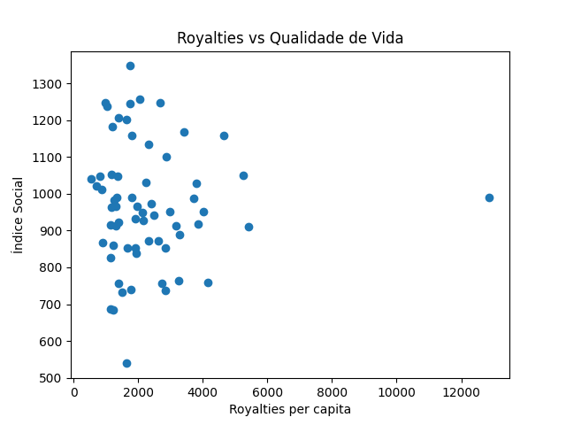
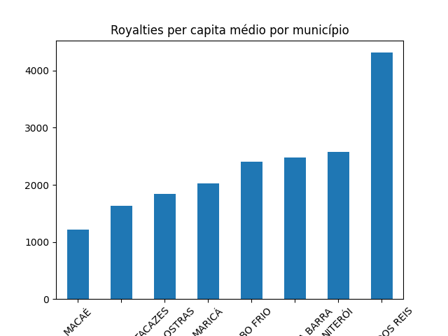

# royalties-analise-rj
Projeto de análise de dados públicos com foco na relação entre royalties do petróleo e indicadores sociais em municípios do estado do Rio de Janeiro. O objetivo é investigar se maiores receitas estão associadas a melhores condições socioeconômicas.

## Resultado da análise

### Relação entre royalties e qualidade de vida

### Ranking de municípios

